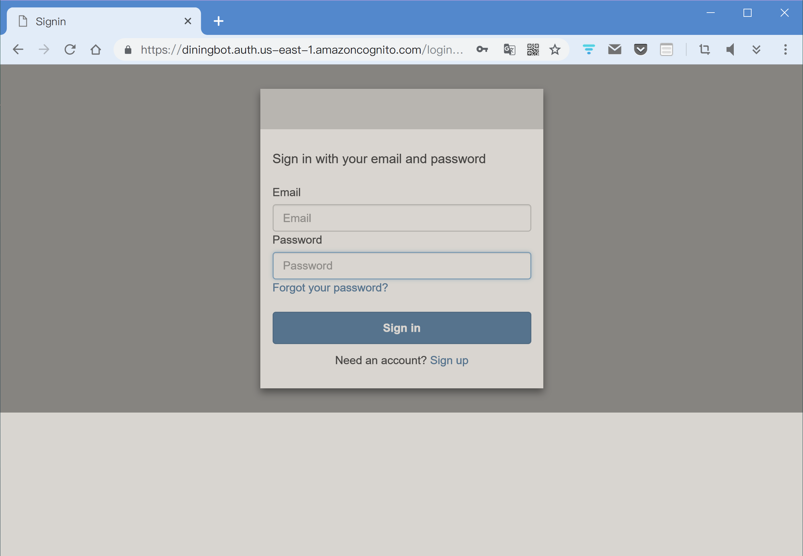
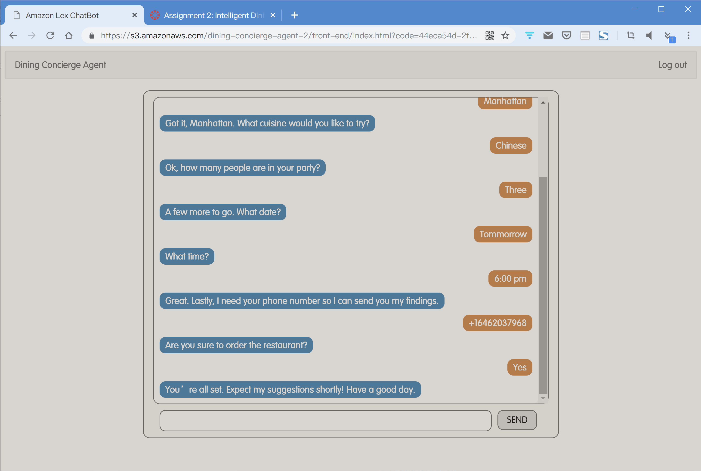
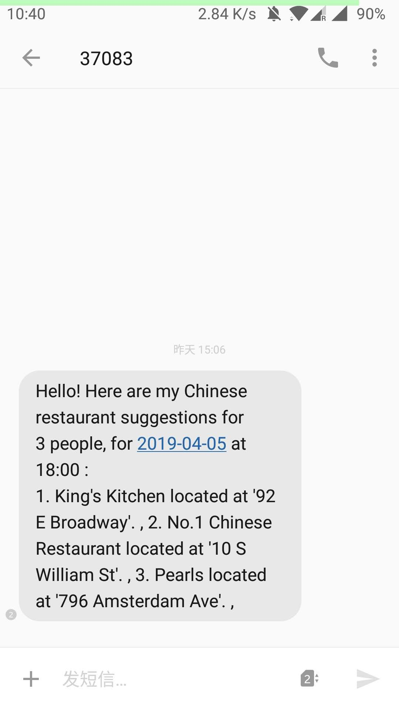
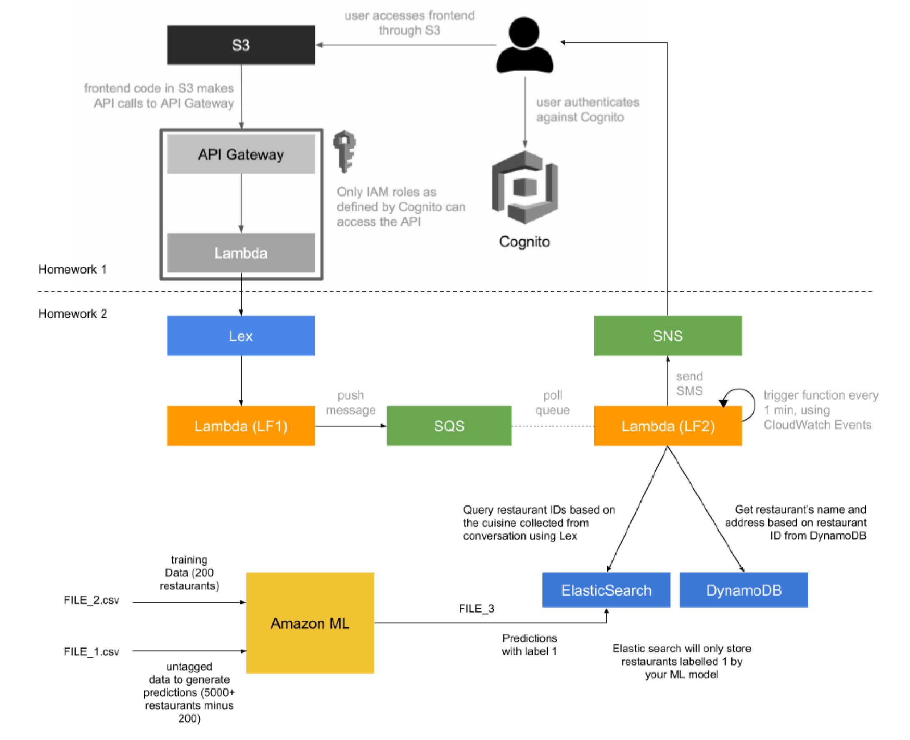

# Dining-Concierge-Agent
Assignment 2 for _Cloud Computing and Big Data_

Checkout `assignment1` branch to reach out Assignment 1 

## Team Members: 

Penghe Zhang (pz2244)

Ruochen You (ry2349)

Hang Yin (hy2568)

## Agent URL

> https://s3.amazonaws.com/dining-concierge-agent-2/front-end/index.html

## Description

First, you need to sign in the web page (AWS Cognito) to access the chat bot page.

Then you can talk to the bot and ask for your dining suggestions

After you typing in your phone number, you will receive a suggestion with three restaurants which are predicted by _Amazon ML_

The architecture diagram:

